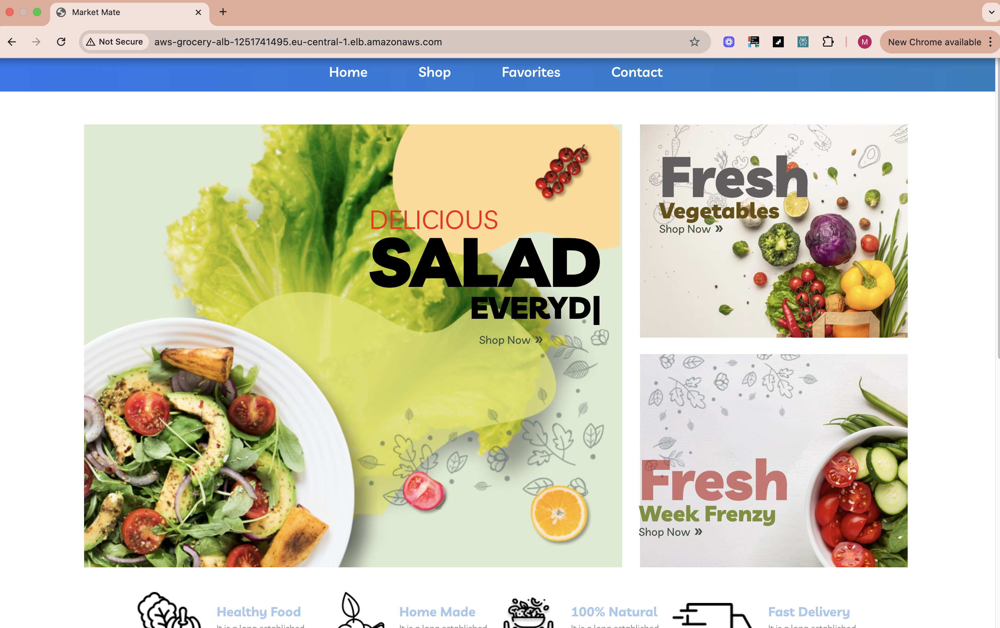
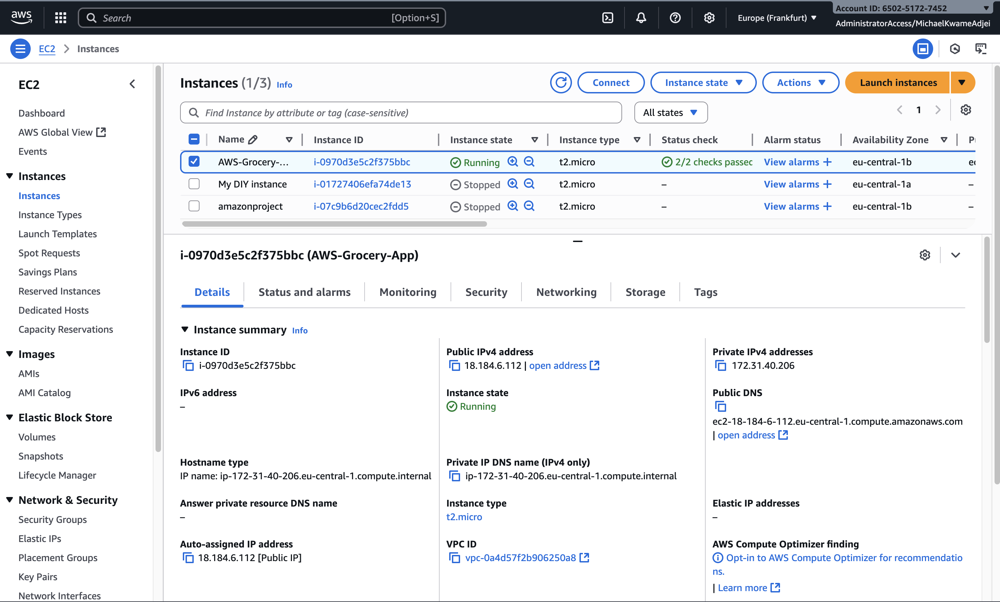
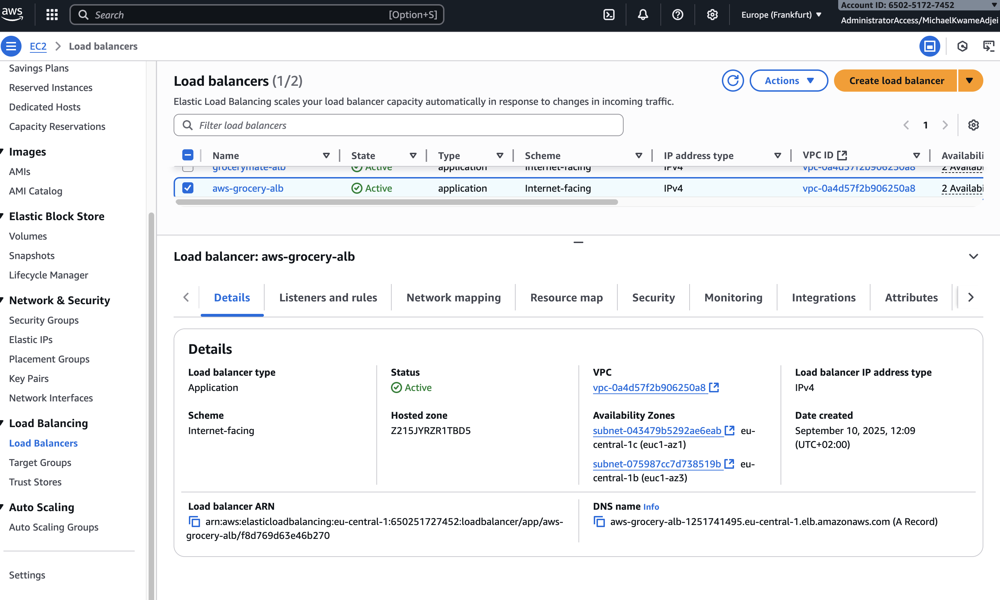
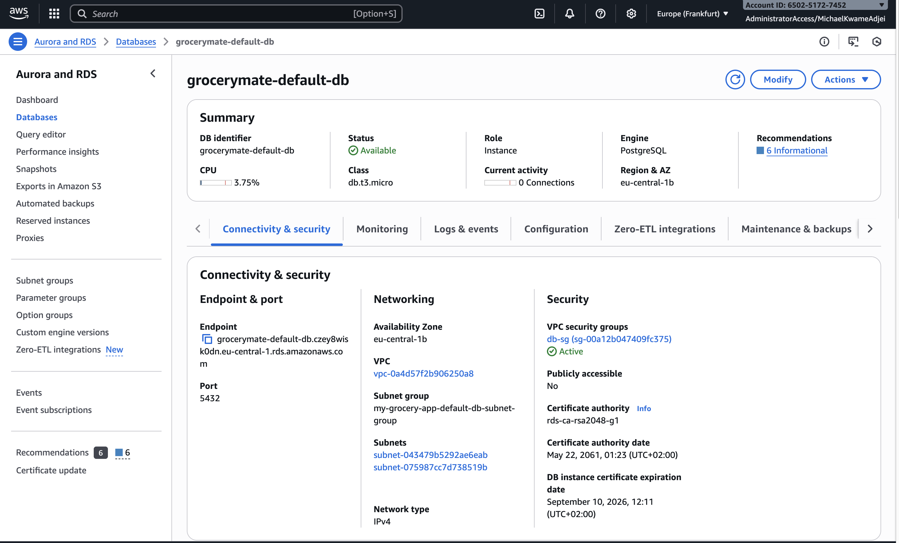
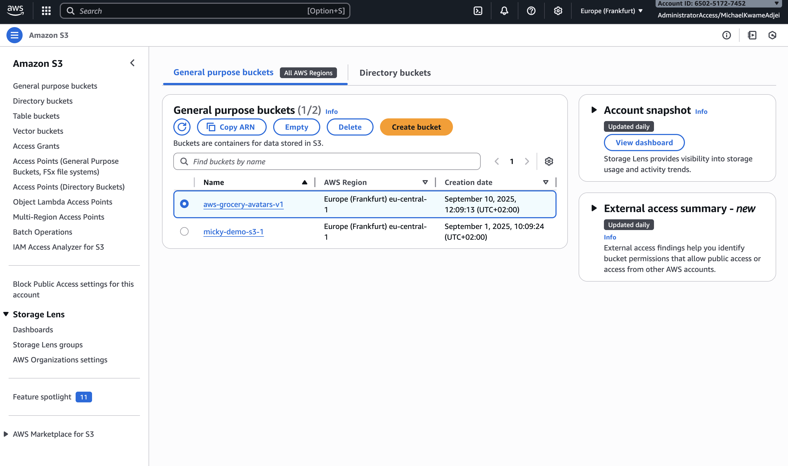
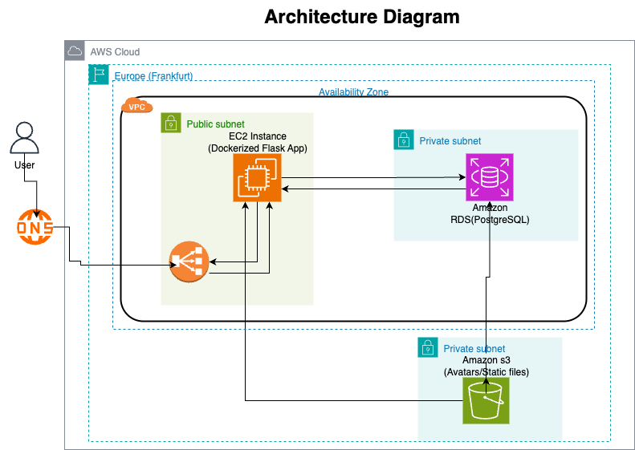

# 🍏 AWS GroceryMate – Cloud-Native Grocery App

> A cloud-native grocery management application that demonstrates end-to-end AWS deployment using Infrastructure as Code (Terraform).

This project serves as a portfolio showcase of skills in:

- 🌐 Full-stack development (React + Flask)  
- ☁️ Cloud infrastructure (AWS EC2, RDS, S3, ALB, Security Groups)  
- ⚙️ Infrastructure as Code (Terraform)  
- 🐳 Containerization (Docker for backend)

---
## 🌐 Live App

🔗 Access the app here:  
👉 [http://aws-grocery-alb-1251741495.eu-central-1.elb.amazonaws.com](http://aws-grocery-alb-1251741495.eu-central-1.elb.amazonaws.com)



## 📖 Features

### 🍽️ Application

- 👨‍🍳 **Frontend**: React + TailwindCSS  
- 🛠 **Backend**: Flask REST API with Docker  
- 🗄 **Database**: PostgreSQL on Amazon RDS  
- 🖼 **File Storage**: AWS S3 for static assets/avatars

### 🏗️ Infrastructure

- 🖥 **Amazon EC2**: Hosts the backend Flask app
- 
- 🔒 **Security Groups**: Least-privilege networking rules  
- 🌍 **Application Load Balancer**: Routes traffic to backend
-   
- 💾 **Amazon RDS**: Managed PostgreSQL database
-   
- 📦 **Amazon S3**: Stores static files (avatars, images)
- 
- 📜 **Terraform**: Manages provisioning and deployment

---

## 📂 Repository Structure

AWS_GroceryMate/
├── backend/ # Flask API (Dockerized)
├── frontend/ # React + Tailwind frontend
├── infrastructure/ # Terraform IaC configs
├── images/ # Screenshots + architecture diagram
└── README.md # Project documentation
---

🛡️ Security Considerations
🔐 Security Groups locked down to required ports (80/443/5432)
🗝️ Secrets (DB password, etc.) managed via terraform.tfvars (not committed to GitHub)
🎭 IAM roles & least privilege access (future enhancement)
🚫 S3 Block Public Access configured — avatars served via pre-signed URLs or CloudFront
---

## 🚀 Deployment

### 1️⃣ Prerequisites

- AWS CLI configured via `aws sso login`  
- Terraform ≥ 1.3 installed  
- Docker (for local backend testing)  
- Node.js & npm (for frontend)

---

### 2️⃣ Deploy Infrastructure

```bash
cd infrastructure
terraform init
terraform plan
terraform apply

---

### 3️⃣ Deploy Application
EC2 instance automatically bootstraps using user_data.sh
Backend Flask app runs in Docker on EC2
Frontend can be hosted on S3 + CloudFront (future improvement)

## 🏗️ Architecture Diagram

This is how your infrastructure is connected:



---

🧹 Cleanup
To avoid AWS charges:
cd infrastructure
terraform destroy

---

🧠 Learnings & Future Improvements
✅ What I Learned
- Automated infrastructure with Terraform — from EC2 to ALB to RDS, all defined as code.
- Secured AWS resources — least privilege security groups, no public DB, locked SSH.
- Integrated S3 for static assets — even with policy restrictions, pre-signed URLs work.
🚀 Future Enhancements
- Host React frontend on S3 + CloudFront
- Use ECS/Fargate for container orchestration
- Add HTTPS with ACM + ALB
- Implement CI/CD with GitHub Actions
- Add monitoring with CloudWatch
